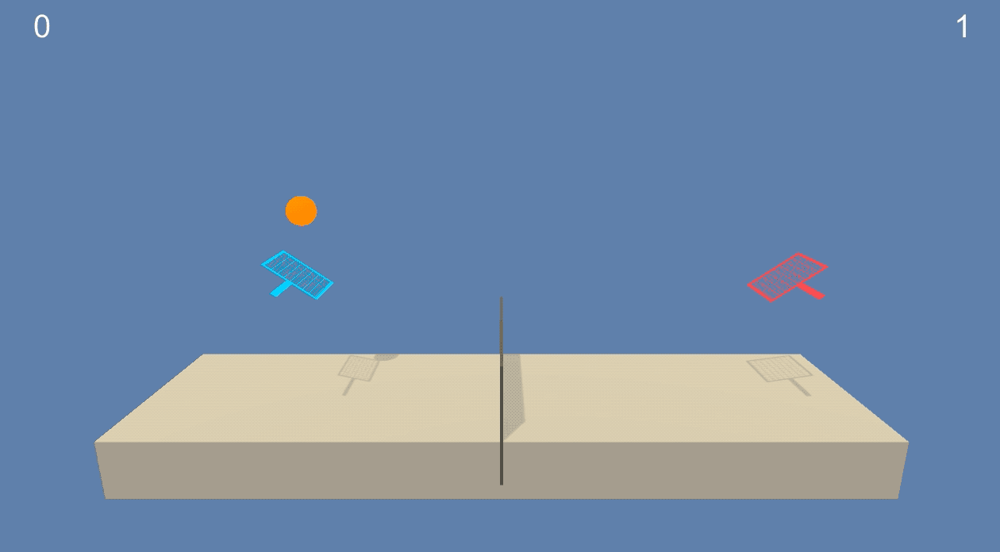
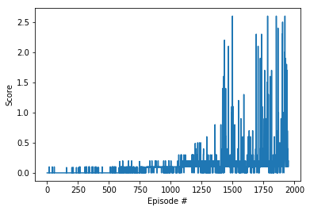
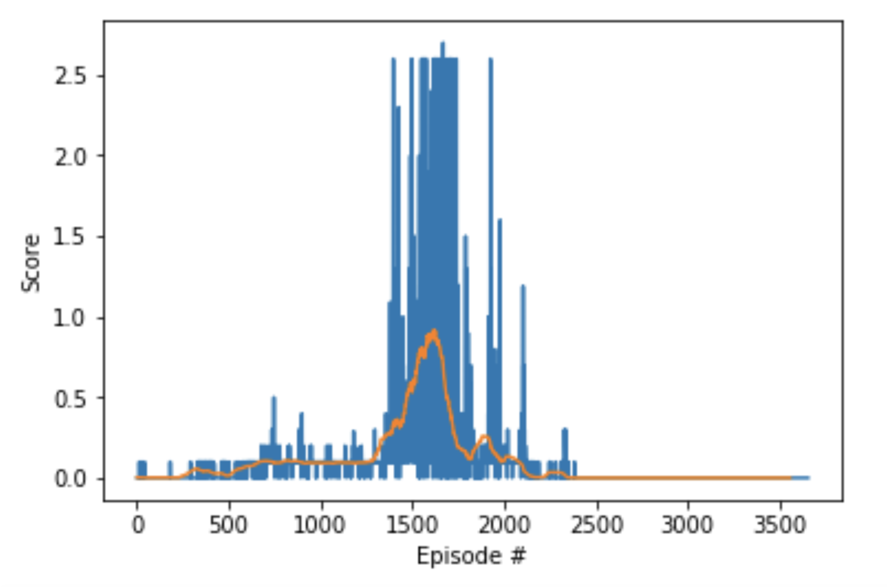

Simple Multi-Agent Reinforcement Learning with DRL
==================================================

How to Solve Simple Multi-Agent Reinforcement Learning Problem by DRL Method(DDPG)
----------------------------------------------------------------------------------

---

We will introduce to solve simple Multi-Agent Reinforcement Learning problem by Deep Reinforcement Learning Method like DDPG with Unity ML-Agents [Tennis](https://github.com/Unity-Technologies/ml-agents/blob/master/docs/Learning-Environment-Examples.md#tennis) environment.

### Prerequisites

#### Theoretical things

-	Read about Traditional Reinforcement Learning : [Reinforcement Learning: An Introduction by Richard S. Sutton and Andrew G. Barto - Second Edition](http://incompleteideas.net/book/the-book.html)
-	Read [REINFORCE algorithm paper](http://www-anw.cs.umass.edu/~barto/courses/cs687/williams92simple.pdf) by Williams 1992.
-	Read [PPO paper](https://arxiv.org/abs/1707.06347) by Open AI 2017.
-	Read the most famous [blog post](http://karpathy.github.io/2016/05/31/rl/) on policy gradient methods.
-	Implement a policy gradient method to win at Pong in this [Medium post](https://medium.com/@dhruvp/how-to-write-a-neural-network-to-play-pong-from-scratch-956b57d4f6e0).
-	Learn more about [evolution strategies](https://blog.openai.com/evolution-strategies/) from OpenAI.
-	Read [A3C paper](https://arxiv.org/abs/1602.01783) by DeepMind ICML 2016.
-	Read [Q-Prop paper](https://arxiv.org/abs/1611.02247) ICLR 2017.
-	Read [A2C - Open AI Baseline Blog post](https://blog.openai.com/baselines-acktr-a2c/).
-	Read [GAE paper](https://arxiv.org/abs/1506.02438).
-	Read [DDPG paper](https://arxiv.org/abs/1509.02971).

	#### Technical things

-	Read about Deep Learnming with PyTorch : https://github.com/udacity/DL_PyTorch

### Optional Reference

#### Theoretical things

-	refer to [Antonio Park's blog about Introduction to DRL](https://parksurk.github.io/drlnd_1_introduction_to_drl-post/).
-	refer to [Antonio Park's blog about Dynamic Programming](https://parksurk.github.io/deep/reinfocement/learning/drlnd_1-3_dynamic_programming-post/).
-	refer to [Antonio Park's blog about Monte Calro Methods](https://parksurk.github.io/deep/reinfocement/learning/drlnd_1-4_monte_calro_methods-post/).
-	refer to [Antonio Park's blog about Temporal-Difference methods](https://parksurk.github.io/deep/reinfocement/learning/drlnd_1-5_temporal_difference_methods-post/).
-	refer to [Antonio Park's blog about DRL Policy-based method](https://parksurk.github.io/deep/reinfocement/learning/drlnd_3_policy_based_methods-post/).

#### Technical things

-	Check about Deep Reinforcement Learnming GitHub with PyTorch by Shangtong Zhang : https://github.com/ShangtongZhang/DeepRL

### Project Details

For this project, you will work with the Unity ML-Agents **Tennis** environment.

<p align="center"> Picture 1 - Tennis-Before Training</p>

<p align="center"> Picture 2 - Tennis-After Training</p>

In this environment, two agents control rackets to bounce a ball over a net. If an agent hits the ball over the net, it receives a reward of +0.1. If an agent lets a ball hit the ground or hits the ball out of bounds, it receives a reward of -0.01. Thus, the goal of each agent is to keep the ball in play.

The observation space consists of 8 variables corresponding to the position and velocity of the ball and racket. Each agent receives its own, local observation. Two continuous actions are available, corresponding to movement toward (or away from) the net, and jumping.

The task is episodic, and in order to solve the environment, your agents must get an average score of +0.5 (over 100 consecutive episodes, after taking the maximum over both agents). Specifically,

After each episode, we add up the rewards that each agent received (without discounting), to get a score for each agent. This yields 2 (potentially different) scores. We then take the maximum of these 2 scores. This yields a single score for each episode. The environment is considered solved, when the average (over 100 episodes) of those scores is at least +0.5.

---

### Getting Started

Follow the instructions below to explore the environment on your own machine! You will also learn how to use the Python API to control your agent.

#### Step 1: Clone the DRLND Repository

If you haven't already, please follow the [instructions in the DRLND GitHub repository](https://github.com/udacity/deep-reinforcement-learning#dependencies) to set up your Python environment. These instructions can be found in README.md at the root of the repository. By following these instructions, you will install PyTorch, the ML-Agents toolkit, and a few more Python packages required to complete the project.

(For Windows users) The ML-Agents toolkit supports Windows 10. While it might be possible to run the ML-Agents toolkit using other versions of Windows, it has not been tested on other versions. Furthermore, the ML-Agents toolkit has not been tested on a Windows VM such as Bootcamp or Parallels.

#### Step 2: Download the Unity Environment

For this project, you will not need to install Unity - this is because we have already built the environment for you, and you can download it from one of the links below. You need only select the environment that matches your operating system:

-	Linux: click [here](https://s3-us-west-1.amazonaws.com/udacity-drlnd/P3/Tennis/Tennis_Linux.zip)
-	Mac OSX: click [here](https://s3-us-west-1.amazonaws.com/udacity-drlnd/P3/Tennis/Tennis.app.zip)
-	Windows (32-bit): click [here](https://s3-us-west-1.amazonaws.com/udacity-drlnd/P3/Tennis/Tennis_Windows_x86.zip)
-	Windows (64-bit): click [here](https://s3-us-west-1.amazonaws.com/udacity-drlnd/P3/Tennis/Tennis_Windows_x86_64.zip)

Then, place the file in the p3_collab-compet/ folder in the DRLND GitHub repository, and unzip (or decompress) the file.

(For Windows users) Check out [this link](https://support.microsoft.com/en-us/help/827218/how-to-determine-whether-a-computer-is-running-a-32-bit-version-or-64) if you need help with determining if your computer is running a 32-bit version or 64-bit version of the Windows operating system.

(For AWS) If you'd like to train the agent on AWS (and have not [enabled a virtual screen](https://github.com/Unity-Technologies/ml-agents/blob/master/docs/Training-on-Amazon-Web-Service.md)), then please use [this link](https://s3-us-west-1.amazonaws.com/udacity-drlnd/P1/Banana/Banana_Linux_NoVis.zip) to obtain the "headless" version of the environment. You will not be able to watch the agent without enabling a virtual screen, but you will be able to train the agent. (To watch the agent, you should follow the instructions to [enable a virtual screen](https://github.com/Unity-Technologies/ml-agents/blob/master/docs/Training-on-Amazon-Web-Service.md), and then download the environment for the Linux operating system above.)

#### Step 3: Explore the Environment

After you have followed the instructions above, open Tennis.ipynb (located in the p3_collab-compet/ folder in the DRLND GitHub repository) and follow the instructions to learn how to use the Python API to control the agent.

Watch the (silent) [video](https://youtu.be/kxDvrkg8ep0) below to see what kind of output to expect from the notebook (for version 2 of the environment), if everything is working properly!

In the last code cell of the notebook, you'll learn how to design and observe an agent that always selects random actions at each timestep. Your goal in this project is to create an agent that performs much better!

#### (Optional) Build your Own Environment

For this project, we have built the Unity environment for you, and you must use the environment files that we have provided.

If you are interested in learning to build your own Unity environments after completing the project, you are encouraged to follow the instructions [here](https://github.com/Unity-Technologies/ml-agents/blob/master/docs/Getting-Started-with-Balance-Ball.md), which walk you through all of the details of building an environment from a Unity scene.

---

### Instructions

To setup our project environment to run the code in this repository, follow the instructions below.

1.	Clone this repository

```
git clone https://github.com/parksurk/drl_marl.git
```

1.	Create (and activate) a new environment with Python 3.6.
	-	Linux or Mac:`
		conda create --name drlnd python=3.6
		`
	-	Windows:`
		conda create --name drlnd python=3.6
		activate drlnd
		`
2.	Follow the instructions in this repository to perform a minimal install of OpenAI gym. (Skip if you done already)
	-	Next, install the classic control environment group by following the instructions here.
	-	Then, install the box2d environment group by following the instructions here.
3.	Clone the repository (if you haven't already!), and navigate to the python/ folder. Then, install several dependencies. (Skip if you done already)

```
git clone https://github.com/udacity/deep-reinforcement-learning.git
cd deep-reinforcement-learning/python
pip install .
```

1.	Create an IPython kernel for the drlnd environment. (Skip if you done already)

```
python -m ipykernel install --user --name drlnd --display-name "drlnd"
```

1.	Run Jupyter Notebook

```
jupyter notebook
```

1.	Before running code in a notebook, change the kernel to match the drlnd environment by using the drop-down Kernel menu.


1.	Click **Report.ipynb** on root directory

 Picture 3 - MADDPG Agent - Score Plot

---

### Benchmark Implementation

in our solution code, we decided to start with the DDPG code to solve this project. To adapt it to train multiple agents, we first noted that each agent receives its own, local observation. Thus, we can easily adapt the code to simultaneously train both agents through self-play. In our case, each agent used the same actor network to select actions, and the experience was added to a shared replay buffer.

#### Note

Note that due to the multi-agent nature of this problem, you are likely to experience a bit of instability during training. For instance, we have plotted the scores plot from the solution code below. The blue line shows the maximum score over both agents, for each episode, and the orange line shows the average score (after taking the maximum over both agents) over the next 100 episodes.

Note that the agents perform horribly starting around episode 2500 and show no evidence of recovery. However, at one point, we accomplished an average score (over 100 episodes) of +0.9148!


